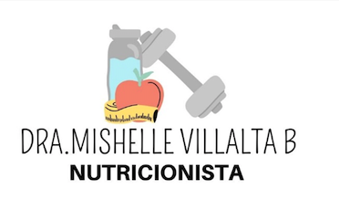

## DRA. Mishelle Villalta - Nutricionista

Este Proyecto ha sido diseñado con la finalidad de proporcionar una aplicación para la administración de los expedientes, citas y perfil de pacientes de la DRA. Mishelle Villalta. 

---

## Integrantes del equipo de Desarrollo

* Jean Carlo Nuñez Jimenez
* Jocelyne González Aguirre 
* Karina Moscoso Gairaud 
* Verónica Mora Vega

---

## Para comenzar a utilizar este repositorio:

1. Descargue e instale de la herramienta [SourceTree](https://confluence.atlassian.com/get-started-with-sourcetree/install-sourcetree-847359094.html) 

2. Una vez instalada, deberá hacer click en k **Check out in SourceTree**. Podría requerir la creación de una cuenta para Source tree.  

3. En la máquina local, cree una carpeta vacía con un nombre significativo, este destino serña utilizado para almacenar el repositorio. 

4. Seleccione "Clone this repository" utilizando SourceTree y navegue hasta la carpeta recien creada.

5. El código deberá clonarse en la máquina local, una vez modificado el código podrá realizar las acciones de "commit" y "push" para actualizarlo en el repositorio. 

Los siguientes links son recomendados en caso de no estar familiarizado con las acciones de ejecucion en un repositorio compartido:

* [Realize cambios y acciones push hacia Bitbucket utilizando SourceTree](https://confluence.atlassian.com/x/iqyBMg)

* [Realize cambios y acciones add, commit](https://confluence.atlassian.com/x/8QhODQ) 

* [Realize acciones Push desde la linea de comandos: ](https://confluence.atlassian.com/x/NQ0zDQ)